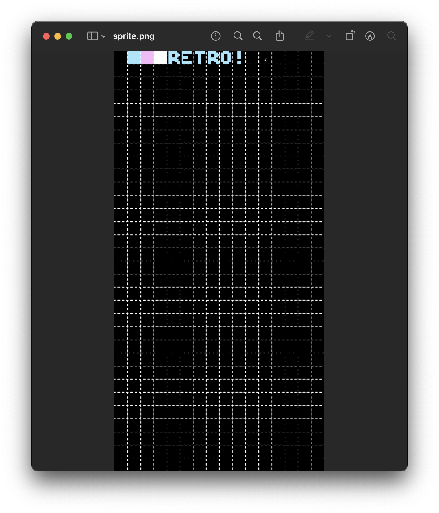

# Graphics and Creating Backgrounds ([**background_sprites.asm**](background_sprites.asm))

This took so long, and not for the reasons you might expect.


<sub>**Figure 1**: The result of this project.</sub>

### Sections

1. [**Creating Sprites**](#creating-sprites)
2. [**Displaying the Sprites as a Background**](#displaying-the-sprites-as-a-background)
    1. [**Housekeeping**](#housekeeping)
    2. [**Our "Driver" Code**](#our-"driver"-code)
    3. [**Loading the Background**](#loading-the-background)
    4. [**Including Our Background Graphics**](#including-our-background-graphics)
    5. [**Loading the Sprite Sheet**](#loading-the-sprite-sheet)
3. [**Concluding Notes**](#concluding-notes)

### Creating Sprites

Putting scan lines onto the Famicom screen is a different monster than on the Atari 2600's—chiefly because of its use of sprites. This really was where the difficulty came in: virtually all good software to generate sprites for the Famicom are for Windows ([**YY-CHR**](https://www.romhacking.net/utilities/119/) is the popular choice). I'll spare the gorey details, but I ended up settling for this neat little [**tool**](https://eonarheim.github.io/NES-Sprite-Editor/) by [**Erik Onarheim**](https://eonarheim.github.io), which is about as simple of a sprite editor as you can get. I was finally able to get my `chr` files this way.



<sub>**Figure 2**: The sprite sheet used in this project.</sub>

I realise that this is likely not the best nor the easiest workflow, but I'd much rather keep the momentum going than get stuck because of software / hardware limitations. There is always time for refactoring later.

### Displaying the Sprites as a Background

It's very likely that I'm wrong here, but I couldn't find helper files containing aliases to the relevant memory addresses for the Famicom like I did with the 2600, so for now, I worked with the addresses that I was given by the tutorial (with the expectation that I would maybe write my own `h` files lates).

#### Housekeeping

This part didn't change much. Aside from the usual `ines` directives, I defined two variables that will be used later. The `.rsset` directive will define where in memory I want to store these variables, while the `.rs` directive will define how many bytes will be allocated for that variable.

In both cases, we only need one byte:

```asm
	.rsset $0000
pointerBackgroundLowByte  .rs 1
pointerBackgroundHighByte .rs 1
```

#### Our "Driver" Code

Here's one of the new blocks, and where I came across a new 6502 instruction: `JSR`. Short for "jump to subroutine, it's basically a function call to whatever argument you give it. In my case, I am telling it to jump to the `LoadBackground` subroutine, which I will talk about in the next section. Everything after that instruction though seems to basically be a bit of flag switching and housekeeping:

```asm
RESET:
	JSR LoadBackground  ; JSR operation will jump to that label, then return here once it is done

	LDA #%10000000		; Binary 128. Enable NMI, sprites and background on table 0...
	STA $2000			; ...which will use that address $2000 we sent the PPU earlier
	LDA #%00011110		; Enables sprites, enable backgrounds—binary 30
	STA $2001
	LDA #$00			; Disable background scrolling
	STA $2006
	STA $2006
	STA $2005
	STA $2005

InfiniteLoop:
    JMP InfiniteLoop    ; Just keep running forever
```

The reason why we use binary values here is because they more easily represent the 6502's flags, each of which is represented by one of the digits.

#### Loading the Background

`LoadBackground` does the following:

1. Resets the PPU by loading the value of memory location `$2002`
2. Storing the literal `#$20` in memory location `$2006`, which is a port that tells the PPU where to store the background data
3. Since memory addresses are 2 bytes each, and we can only send 1 byte at a time, we have to load a value into memory location `$2006` again. We use `#$00` for this.

```asm
LoadBackground:
    ; Step 1
	LDA $2002

    ; Step 2
	LDA #$20						
	STA $2006

    ; Step 3
	LDA #$00bytes and we can only send 1 byte at a time
	STA $2006
```

We now have to loop through our data and store it from the lowest "background byte" to the highest "background byte" (the `background` section gets explained in the next section). Here's where our variables come in. Using our `nesasm` assembler's pre-defined `#LOW` and `#High` functions, we respectively load these lowest and highest bytes into the variables:

```asm
	LDA #LOW(background)
	STA pointerBackgroundLowByte

	LDA #HIGH(background)
	STA pointerBackgroundHighByte
```

---

Now for the loop itself. There's two sections to this, the first using the `Y` register to iterate, and the second using the `X` register. For section 1, we load `pointerBackgroundLowByte`, offset it by the current value of the `Y` register, and store it in memory location `$2007`.

Doing this loads one graphical tile (`$00` being the first) to the PPU, so a loop sends all of our data to this address until it overflows and resets back to zero. At this point, our loop will break and we will be done with this first part:

```asm
	LDX #$00						  ; x = 0x0
	LDY #$00						  ; y = 0x0
.BackgroundLoop:					  ; . denotes a local method
	LDA [pointerBackgroundLowByte],y
	STA $2007

	INY                               ; y++
	CPY #$00
	BNE .BackgroundLoop
```

The second part of the loop requires some explanation, which I think Jonathan does quite well:

> Each byte of data will represent one graphical tile on the screen (an 8x8 pixel square). The resolution for the NES is 256x240 pixels, so a background will be made up of 32 tiles across, and 30 tiles down. If you do the math, that means **we need 960 bytes to accomplish this**.

We can only store a single byte with a single register (the `Y` register, thus far), so we can only reach a value of **256 before we start to overflow**. Since we need 960 bytes, the `X` register will take care of allowing this overflow to happen 4 times (1024 bytes) before ending the loop, which is enough to get the 960 bytes of data necessary:

```asm
	INC pointerBackgroundHighByte
	INX
	CPX #$04
	BNE .BackgroundLoop
	RTS
```

Here, `RTS` ("return from subroutine") will mark the end of our subroutine and return to where it was called.

#### Including Our Background Graphics

In order to actually store our sprites onto our memory banks defined by `#LOW` and `#HIGH` earlier, we need to define the byte(s) that we will use in our loop. For this, we use the `.db` directive, which is followed by one or more byte-sized constants. Defining these 960 bytes is a very long and tedious operation, and clutters our code quite a bit:

```asm
    ; lmao
    .db $00,$00,$00,$00,$00,$00,$00,$00,$00,$00,$00,$00,$00,$00,$00,$00
    .db $00,$00,$00,$00,$00,$00,$00,$00,$00,$00,$00,$00,$00,$00,$00,$00

    .db $00,$00,$00,$00,$00,$00,$00,$00,$00,$00,$00,$00,$00,$00,$00,$00
    .db $00,$00,$00,$00,$00,$00,$00,$00,$00,$00,$00,$00,$00,$00,$00,$00

    .db $00,$00,$00,$00,$00,$00,$00,$00,$00,$00,$00,$00,$00,$00,$00,$00
    .db $00,$00,$00,$00,$00,$00,$00,$00,$00,$00,$00,$00,$00,$00,$00,$00

    .db $00,$00,$00,$00,$00,$00,$00,$00,$00,$00,$00,$00,$00,$00,$00,$00
    .db $00,$00,$00,$00,$00,$00,$00,$00,$00,$00,$00,$00,$00,$00,$00,$00

    .db $00,$00,$00,$00,$00,$00,$00,$00,$00,$00,$00,$00,$00,$04,$05,$06
    .db $07,$08,$09,$00,$00,$00,$00,$00,$00,$00,$00,$00,$00,$00,$00,$00

    .db $00,$00,$00,$00,$00,$00,$00,$00,$00,$00,$00,$00,$00,$00,$00,$00
    .db $00,$00,$00,$00,$00,$00,$00,$00,$00,$00,$00,$00,$00,$00,$00,$00

    .db $00,$00,$00,$00,$00,$00,$00,$00,$00,$00,$00,$00,$00,$00,$00,$00
    .db $00,$00,$00,$00,$00,$00,$00,$00,$00,$00,$00,$00,$00,$00,$00,$00

    .db $01,$01,$01,$01,$01,$01,$01,$01,$01,$01,$01,$01,$01,$01,$01,$01
    .db $01,$01,$01,$01,$01,$01,$01,$01,$01,$01,$01,$01,$01,$01,$01,$01

    .db $01,$01,$01,$01,$01,$01,$01,$01,$01,$01,$01,$01,$01,$01,$01,$01
    .db $01,$01,$01,$01,$01,$01,$01,$01,$01,$01,$01,$01,$01,$01,$01,$01

    .db $01,$01,$01,$01,$01,$01,$01,$01,$01,$01,$01,$01,$01,$01,$01,$01
    .db $01,$01,$01,$01,$01,$01,$01,$01,$01,$01,$01,$01,$01,$01,$01,$01

    .db $01,$01,$01,$01,$01,$01,$01,$01,$01,$01,$01,$01,$01,$01,$01,$01
    .db $01,$01,$01,$01,$01,$01,$01,$01,$01,$01,$01,$01,$01,$01,$01,$01

    .db $01,$01,$01,$01,$01,$01,$01,$01,$01,$01,$01,$01,$01,$01,$01,$01
    .db $01,$01,$01,$01,$01,$01,$01,$01,$01,$01,$01,$01,$01,$01,$01,$01

    .db $01,$01,$01,$01,$01,$01,$01,$01,$01,$01,$01,$01,$01,$01,$01,$01
    .db $01,$01,$01,$01,$01,$01,$01,$01,$01,$01,$01,$01,$01,$01,$01,$01

    .db $01,$01,$01,$01,$01,$01,$01,$01,$01,$01,$01,$01,$01,$01,$01,$01
    .db $01,$01,$01,$01,$01,$01,$01,$01,$01,$01,$01,$01,$01,$01,$01,$01

    .db $02,$02,$02,$02,$02,$02,$02,$02,$02,$02,$02,$02,$02,$02,$02,$02
    .db $02,$02,$02,$02,$02,$02,$02,$02,$02,$02,$02,$02,$02,$02,$02,$02

    .db $02,$02,$02,$02,$02,$02,$02,$02,$02,$02,$02,$02,$02,$02,$02,$02
    .db $02,$02,$02,$02,$02,$02,$02,$02,$02,$02,$02,$02,$02,$02,$02,$02

    .db $02,$02,$02,$02,$02,$02,$02,$02,$02,$02,$02,$02,$02,$02,$02,$02
    .db $02,$02,$02,$02,$02,$02,$02,$02,$02,$02,$02,$02,$02,$02,$02,$02

    .db $02,$02,$02,$02,$02,$02,$02,$02,$02,$02,$02,$02,$02,$02,$02,$02
    .db $02,$02,$02,$02,$02,$02,$02,$02,$02,$02,$02,$02,$02,$02,$02,$02

    .db $02,$02,$02,$02,$02,$02,$02,$02,$02,$02,$02,$02,$02,$02,$02,$02
    .db $02,$02,$02,$02,$02,$02,$02,$02,$02,$02,$02,$02,$02,$02,$02,$02

    .db $02,$02,$02,$02,$02,$02,$02,$02,$02,$02,$02,$02,$02,$02,$02,$02
    .db $02,$02,$02,$02,$02,$02,$02,$02,$02,$02,$02,$02,$02,$02,$02,$02

    .db $02,$02,$02,$02,$02,$02,$02,$02,$02,$02,$02,$02,$02,$02,$02,$02
    .db $02,$02,$02,$02,$02,$02,$02,$02,$02,$02,$02,$02,$02,$02,$02,$02

    .db $03,$03,$03,$03,$03,$03,$03,$03,$03,$03,$03,$03,$03,$03,$03,$03
    .db $03,$03,$03,$03,$03,$03,$03,$03,$03,$03,$03,$03,$03,$03,$03,$03

    .db $03,$03,$03,$03,$03,$03,$03,$03,$03,$03,$03,$03,$03,$03,$03,$03
    .db $03,$03,$03,$03,$03,$03,$03,$03,$03,$03,$03,$03,$03,$03,$03,$03

    .db $03,$03,$03,$03,$03,$03,$03,$03,$03,$03,$03,$03,$03,$03,$03,$03
    .db $03,$03,$03,$03,$03,$03,$03,$03,$03,$03,$03,$03,$03,$03,$03,$03

    .db $03,$03,$03,$03,$03,$03,$03,$03,$03,$03,$03,$03,$03,$03,$03,$03
    .db $03,$03,$03,$03,$03,$03,$03,$03,$03,$03,$03,$03,$03,$03,$03,$03

    .db $03,$03,$03,$03,$03,$03,$03,$03,$03,$03,$03,$03,$03,$03,$03,$03
    .db $03,$03,$03,$03,$03,$03,$03,$03,$03,$03,$03,$03,$03,$03,$03,$03

    .db $03,$03,$03,$03,$03,$03,$03,$03,$03,$03,$03,$03,$03,$03,$03,$03
    .db $03,$03,$03,$03,$03,$03,$03,$03,$03,$03,$03,$03,$03,$03,$03,$03

    .db $03,$03,$03,$03,$03,$03,$03,$03,$03,$03,$03,$03,$03,$03,$03,$03
    .db $03,$03,$03,$03,$03,$03,$03,$03,$03,$03,$03,$03,$03,$03,$03,$03

    .db $03,$03,$03,$03,$03,$03,$03,$03,$03,$03,$03,$03,$03,$03,$03,$03
    .db $03,$03,$03,$03,$03,$03,$03,$03,$03,$03,$03,$03,$03,$03,$03,$03

    .db $03,$03,$03,$03,$03,$03,$03,$03,$03,$03,$03,$03,$03,$03,$03,$03
    .db $03,$03,$03,$03,$03,$03,$03,$03,$03,$03,$03,$03,$03,$03,$03,$03

    .db $03,$03,$03,$03,$03,$03,$03,$03,$03,$03,$03,$03,$03,$03,$03,$03
    .db $03,$03,$03,$03,$03,$03,$03,$03,$03,$03,$03,$03,$03,$03,$03,$03

    .db $03,$03,$03,$03,$03,$03,$03,$03,$03,$03,$03,$03,$03,$03,$03,$03
    .db $03,$03,$03,$03,$03,$03,$03,$03,$03,$03,$03,$03,$03,$03,$03,$03
```

In order to avoid this clutter, I stored these addresses in a file called [**`background_addresses.asm`**](assets/background_addresses.asm), and included it using the `.include` directive:

```asm
	.bank 1
	.org $E000

background:
	.include "assets/background_addresses.asm"

    ; More housecleaning
	.org $FFFA
	.dw NMI				  ; non-maskable interrupt
	.dw RESET
	.dw 0
```

#### Loading the Sprite Sheet

Finally, we will _actually_ include out sprite sheet. For this, we set up an empty bank and include the `chr` file as a binary file:

```asm
	.bank 2
	.org $0000
    .incbin "graphics.chr"
```

### Concluding Notes

This one was...a lot, but by far the most satisfying to get to work. I was, mercifully, able to find a Mac equivalent to the Famitracker, so hopefully I won't have to go through this again when it comes time to adding sound and music. Technology limitations is by far the most frustrating reason to not move forward with projects, so I'm glad I managed to overcome it.

Let's hope it doesn't happen again!