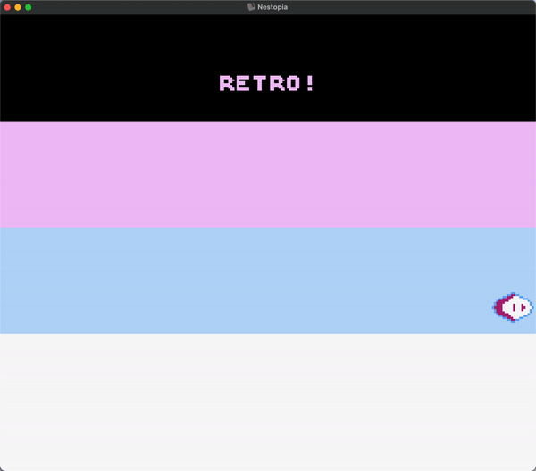

# Simple Collision Detection: Screen Borders ([**borders.asm**](borders.asm))

This is it: the first concept I "figured out" by myself. Granted, it's probably not a big one, but it was for my self-esteem.

**Figure 1**: Begone, impostor syndrome.

### Sections

_Coming Soon_