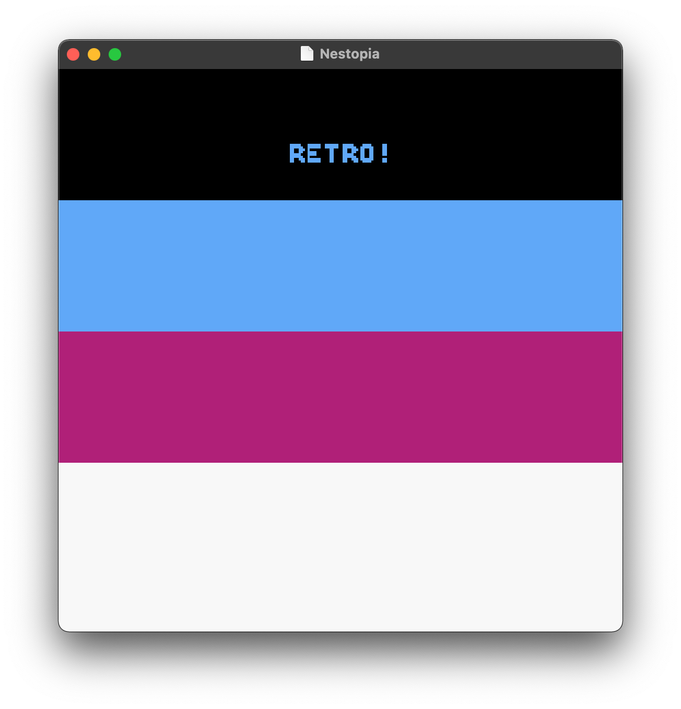

# [**Applying Color Palettes**](background-palettes.asm)

First proper bug in this project. It was was actually kind of fun to see something new like that.



<sub>**Figure 1**: The result of this project.</sub>

### Sections

1. [**A First: Making an `h` File**](#a-first-making-an-h-file)
    1. [**Setup Registers**](#setup-registers)
    2. [**PPU Registers**](#ppu-registers)
    3. [**Interrupt Request (IRQ)**](#interrupt-request-irqhttpswwwnesdevorgwikiirq)
2. [**Loading our Colour Palettes**](#loading-our-colour-palettes)
3. [**Loading our Background Tile Attribute Table**](#loading-our-background-tile-attribute-table)
4. [**An Unexpected Bug: Debugging 6504 Assembly**](#an-unexpected-bug-debugging-6504-assembly)

### A First: Making an `h` File

I mentioned in the [**previous project**](https://github.com/sebastianromerocruz/famicom-6502-projects/tree/main/background-sprites#displaying-the-sprites-as-a-background) that I was not able to find any `h` files that contained some common NES 6502 memory registers, which I found odd (for reference, two of the first resources I was given for my Atari 2600 project were two [**`h` files**](https://github.com/sebastianromerocruz/atari-6502-projects/tree/main/assets/helper-files)). I wasn't necessarily worried about this—I figured that actually _seeing_ and typing the relevant memory registers would be good for my general knowledge of the 6502 (this turned out to be correct). But then, upon finishing this project up, it occurred to me that if I can't find `h` files for the Famicom to help me out here, why don't I make my own?

So, before we get to the actual new assembly sections, let me talk a bit about this file.

---

To be honest, I'm not super well-versed on the use of `h` files outside of C/C++. Aside from `Makefile`, it's one of those things I always saw on Github repos but never really thought about in detail. I'm not sure if there is a conventional way to set these up for the NES, but here's how I went about it.

#### Setup Registers

The first two were two simple housekeeping-related ones—namely, the location of our variables (`$0000`, which I named `VARLOC`) and the location in the CPU of the first bank (`$C000`, which I named `CPUADR`). I used the `ORG` keyword, which is similar to the `.org` directive that I've been using with the 2600 to go to a specific location in memory:

```asm
	ORG $0000
VARLOC ds 1			; Where in memory our variables will be located

	ORG $C000
CPUADR ds 1			; Where in the CPU’s address space bank 0 is located
```

Note that the `ds` directive, which is used to reserve memory, is being used here to move the "memory pointer". For example `CDUADR` will represent memory location `$C000`, but if I were to define another memory alias directly below it (without changing the origin with `ORG`), it would represent the location `$C001`. This may be intuitive to some, but I kind of had to figure that out by looking for patterns in the 2600's [**`vcs.h` file**](https://github.com/sebastianromerocruz/atari-6502-projects/blob/main/assets/helper-files/vcs.h).

#### PPU Registers

These were the ones that made me really want the `h` file for. The [**PPU**](https://www.nesdev.org/wiki/PPU), or picture processing unit...

> ...generates a composite video signal with 240 lines of pixels, designed to be received by a television.

Since these past two lectures have been focused on background graphics, I've been seeing the PPU register range, `$2000` to `$2007`, a lot. Like I said earlier, I was relatively okay with not having mnemonics for these, but making the file actually forced me to look up what each of these values means and what they _do_, which was a really great (and unexpected) learning experience.

```asm
	ORG $2000
PPUCTRL     ds 1    ; $2000 —> Controller
PPUMASK		ds 1    ; $2001 —> Mask
PPUSTATUS 	ds 1    ; $2002 —> Status register
OAMADDR 	ds 1    ; $2003 -> OAM (Object Attribute Memory) address port
OAMDATA		ds 1    ; $2004 -> OAM data port
PPUSCROLL	ds 1    ; $2005 -> Scrolling position register
PPUADDR		ds 1    ; $2006 -> Address register
PPUDATA		ds 1    ; $2006 -> PPU data port
```

#### [**Interrupt Request (IRQ)**](https://www.nesdev.org/wiki/IRQ)

The final two are just interrupt-related aliases. Interrupts, I found out, apparently...

> ...keep inputs which are not necessarily active from causing spurious interrupts which must he handled by the microprocessor.

<sub>**Source**: 6502 Programming Manual, section [**11.1 `MCS6520 INTERRUPT CONTROL`**](http://users.telenet.be/kim1-6502/6502/proman.html#111).</sub>

```asm
	ORG $E000
IRQRD		ds 1

	ORG $FFFA
IRQRE		ds 1
```

### Loading our Colour Palettes

The only thing that changed in the `RESET` section is the addition of the following two lines right after jumping to our `LoadBackground` subroutine:

```asm
	JSR LoadPalettes
	JSR LoadAttributes
```

So, aside from loading up the actual sprite information, we also need to load the NES's colour palette and tile attributes.

The palette-loading loop is similar to that of the sprites', but much smaller (32 bytes). For the sake of keeping my files as organised as possible, I put these too in a separate file, [**palettes.asm**](assets/palettes.asm):

```asm
    .db $0F,$21,$15,$30, $0F,$0F,$0F,$0F, $0F,$0F,$0F,$0F, $0F,$0F,$0F,$0F
    .db $0F,$21,$15,$30, $0F,$0F,$0F,$0F, $0F,$0F,$0F,$0F, $0F,$0F,$0F,$0F
```

Each group of four bytes is a single NES colour palette. The reason for this is explained by Jonathan in his tutorial series:

> We can choose a subset of these 54 possible colors to use at any particular time in our game. A single color palette contains 4 colors, and we can choose from 4 possible color palettes for the background, and 4 possible color palettes for the sprites.

The first color palette above, for example, consists of:

1. Black (`$0F`)
2. Light blue (`$21`)
3. Red (`$15`)
4. White (`$30`)

I include this file in bank 1 at the end of the file, but wrote the `LoadPalettes` subroutine right below the `LoadBackground` subroutine:

```asm
LoadPalettes:
	LDA PPUSTATUS					  ; Resets the PPU
	LDA #$3F						  ; This is where the palette data is located on the PPU.
	STA PPUADDR

	LDA #$00						  ; And we perform this operation to fill out the 2 bytes required
	STA PPUADDR

	LDX #$00
.PaletteLoop:
	LDA palettes,x					  ; Load one palette byte into the PPU one at a time (X-offset)
	STA PPUDATA
	INX
	CPX #$20						  ; Keep doing this until #$20, or 32 decimal
	BNE .PaletteLoop

	RTS
```

Notice that, unlike `LoadBackground`, there was no need for an inner loop. This is because 32 bytes is well underneath the 256-byte overflow limit, so we're safe from such a situation.

### Loading our Background Tile Attribute Table

Due to hardware limitations, we have to assign the colour palettes in groups of tiles instead of individual tiles; each byte which a 32x32 pixel square, or 4x4 tiles. These values—64 bytes worth of data—will be saved in a separate file as well, [**attributes.asm**](assets/attributes.asm). They are recommended to be in binary as the way they are operated upon lends itself to ease of access of individual bits.

```asm
    .db %00000000, %00000000, %00000000, %00000000, %00000000, %00000000, %00000000, %00000000
    .db %00000000, %00000000, %00000000, %00000000, %00000000, %00000000, %00000000, %00000000
    .db %00000000, %00000000, %00000000, %00000000, %00000000, %00000000, %00000000, %00000000
    .db %00000000, %00000000, %00000000, %00000000, %00000000, %00000000, %00000000, %00000000
    .db %00000000, %00000000, %00000000, %00000000, %00000000, %00000000, %00000000, %00000000
    .db %00000000, %00000000, %00000000, %00000000, %00000000, %00000000, %00000000, %00000000
    .db %00000000, %00000000, %00000000, %00000000, %00000000, %00000000, %00000000, %00000000
    .db %00000000, %00000000, %00000000, %00000000, %00000000, %00000000, %00000000, %00000000
```

For example, let's say we have the following byte: `%00011011`. Each set of two bits will the define the colour palette for a 16x16 pixel (2x2 tile) quadrant. Therefore, we can break out byte above into the following:


> `00 01 10 11`

<sub>Notice that in this byte, we are using all four possible colour palettes.</sub>

Starting in the bottom left corner and moving counter-clockwise, the sets of 2 bits will create the colour palettes for the 2x2 tile quadrants. I.e.:
1. The first colour palette (`00`) will be assigned to the bottom left corner.
2. The second color palette (`01`) will be in the bottom right corner.
3. The third (`10`) is in the top right corner.
4. The fourth color palette (`11`) is used in the top left corner.

The 64-bytes of data from `attributes.asm` are included below the palette file in bank 1, and looks pretty much identical to `LoadPalettes`:

```asm
LoadAttributes:
	LDA PPUSTATUS
	LDA #$23						   ; Where attribute data is store in the PPU
	STA PPUADDR
	
	LDA #$C0						   ; PPU stores its attribute data at memory address $23C0
	STA PPUADDR

	LDX #$00
.AttributeLoop:
	LDA attributes,x
	STA PPUDATA
	INX
	CPX #$40							; Keep doing this until #$40, or 64 decimal
	BNE .AttributeLoop
	
	RTS
```

### An Unexpected Bug: Debugging 6504 Assembly

The inclusion of our two palette and attribute tables happens below our bank 1 demarcation:

```asm
	.bank 1
	.org IRQRD

background:
	.include "assets/background_addresses.asm"

palettes:
	.include "assets/palettes.asm"

attributes:
	.include "assets/attributes.asm"

	.org IRQRE
	.dw NMI
	.dw RESET
	.dw 0
```

It looks like a pretty obvious placing when looking at it now, but when I was first working on the palette section of this project, I placed both the `palettes` and `attributes` sections _below_ the `.dw` directives. When I attempted to assemble my code, I was met with my first 6504 assembly error:

```text
./nesasm background-palettes.asm
NES Assembler (v3.1)

pass 1
#[2]   assets/palettes.asm
   11  01:0010                .db $0F,$21,$15,$30, $0F,$0F,$0F,$0F, $0F,$0F,$0F,$0F, $0F,$0F,$0F,$0F
       Bank overflow, offset > $1FFF!
# 1 error(s)
```

Thus far, the only errors I had encountered when attempting to assemble were because I misspelt the name of a file, or something trivial like this. So this was the first time I saw something going wrong directly related to lines of code that _I_ wrote. I know errors are not exactly something to get happy about, but it was kind of the first time that I felt like a proper assembly programmer, which was nice. Anyway, I did what every professional and responsible programmer does when encountering an error and immediately googled it.

In particular, that `$1FFF` hex address caught my eye for being both oddly specific and seemingly unrelated to the line specified by the error message. I googled that line first and came across...not much at all. The truth sometimes is that, as a programmer getting into a new technology, fishing for help on the internet is only helpful when your footing is already relatively stable with said technology. As somebody who had only assembled their first Famicom cart not one month ago, I was clearly not there yet; I probably had better odds by comparing my code with Jonathan's and reverse engineer the logic later. I did exactly that, and realised that it really was just the placing on these lines within bank 1. An easy fix.

---

But what is this error, exactly? I suspect I won't be able to answer that question with full confidence for a bit longer, but there was a number in my `h` file that look conspicuously suspicious:

```asm
	ORG $E000

IRQRD		ds 1
```

My IRQ disable address, `IRQRD`. The reason by this address looked sus is probably pretty obvious. If you add `$1FFF` and `$E000`, you get `$FFFF`—the max value a 1-byte instruction can hold.

I'm supposing that, by placing my `.include` directives _after_ my IRQ `.org` directives, I was causing some memory mayhem. Again, not super well-versed in this environment yet, but I hope to have a better idea of what exactly is happening.