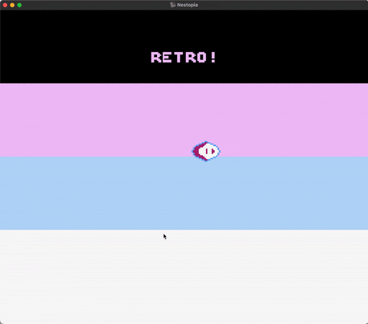

# [**Reading Controller Input**](controllers.asm)

I almost gave up on this whole NES development thing between the span of these last two projects. It probably did me some good though.



<sub>**Figure 1**: The result of this project.</sub>

### Sections

1. [**On Constants and Giving Up**](#part-1-on-constants-and-giving-up)
2. [**A Second `h` File**](#part-2-a-second-h-file)
3. [**Controller Input**](#part-3-controller-input)
    1. [**`ReadPlayerOneControls`**](#readplayeronecontrols)
    2. [**`ReadUp`**](#readup)
    3. [**`ReadDown`**](#readdown)
    4. [**`ReadLeft` and `ReadRight`**](#readleft-and-readright)
4. [**Next Steps**](#part-5-next-steps)

### Part 1: _On Constants and Giving Up_

I am not entirely sure what happened between the sprites project and this one but, when I rewrote my code, I had previously defined some constants in my file like this:

```asm
SOMETHING = #$01
```

<sub>**Code Block 1**: What I thought was a perfectly reasonable assignment.</sub>

And it assembled perfectly fine. This time around, however, I kept getting an error for the following nature:

```
NES Assembler (v3.1)

pass 1
#[1]   controllers.asm
   20  00:FFFB            SOMETHING = #$01
       Syntax error in expression!
# 1 error(s)
```

Not exactly helpful. I typically teach Python at NYU, so when I encounter the words "syntax error" my mind automatically starts looking for...well, syntax error-y type things. So why on earth would the assignment of the hexadecimal value `01` to the label `SOMETHING` be suddenly giving me so much grief? It almost felt like a form of gaslighting, even—I had, after all, apparently assembled code like that before in the sprites project. Except now even _that_ `asm` file wouldn't assemble.

I tend to have a good amount of patience when learning new things—you kind of have to when you're an educator—but this almost made me, for a lack of a better expression, rage quit NES development. The only way I could get my code to assemble again was, seemingly, to forgo constants and just use the values directly in each line. Which, like, sure, definitely possible. But the fact that I was running into what, at the time, felt like such a basic error at this point made me feel like perhaps I just wasn't meant to do this after all.

Anyway. Dramatics aside, the solution apparently is that constants (at least in my case) can cannot have both a literal "modifier" (i.e. `#`) and their respective number system modifier (such as `$` for hex and `%` for binary). In other words, the solution to fixing the error in code block 1 above is to simply define it as `$01`. And then, if we want to use this hex 1 constant as a literal, we do the following in code:

```asm
SOMETHING = $01

    STA #SOMETHING
```

<sub>**Code Block 2**: The solution to my big drama.</sub>

Figuring this out gave me a huge self-esteem boost. And what I do best when I get self-esteem boosts is to refactor my code to make it more readable to myself. So let's look into this project's progress.

### Part 2: _A Second `h` File_

Assembly is already prone to looking bulky by virtue of its commands being able to do a single thing in any given line, so crowding my main `asm` file with them was going to quickly get out of control since we're starting user control input, and each sprite tile necessitates its own value. As such, I created a [**completely separate `h` file**](assets/helper/constants.h) to store my constants, and renamed my `nes.h` file to [**`addresses.h`**](assets/helper/addresses.h) for clarity.

I also reorganised my folder structure to be a bit neater, and it now looks like this:

```
[controllers]
  |
  |-- controllers.asm
  |-- README.md
  |-- Makefile
  |-- [assets]
        |
        |--[banks]
        |    |
        |    |-- attributes.asm
        |    |-- background.asm
        |    |-- bubble.asm
        |    |-- palettes.asm
        |
        |--[helper]
        |    |
        |    |-- addresses.h
        |    |-- constants.h
        |
        |--[images] (for the README.md)
        |    |
        |    |-- controller.gif
        |
        |--[sprites]
             |
             |-- graphics.chr
```

<sub>**Figure 2**: My beautiful new folder structure.</sub>

Looking at it now, I'm not really sure if having a whole sub-folder for my `chr` file is entirely necessary, since to my understanding I will only have one of those. But, I guess, for the sake of consistency I'll leave it there for now.

---

All of this is to say that the top of my main `asm` file now looks like this:

```asm
;;;;;;;;;;;;;;;;;;;;;;;;;;;;;;;;;;;;;;;;;;;;;;;;;;;;;;;;;;;;;;;;;;;;;;;;;;;;;;;;;;;;;;;;;;;;;;;;;;;;;;;;;
;; 1. Housecleaning `.ines` directives
;;;;;;;;;;;;;;;;;;;;;;;;;;;;;;;;;;;;;;;;;;;;;;;;;;;;;;;;;;;;;;;;;;;;;;;;;;;;;;;;;;;;;;;;;;;;;;;;;;;;;;;;;
    .inesprg 1
    .ineschr 1
    .inesmap 0
    .inesmir 1

;;;;;;;;;;;;;;;;;;;;;;;;;;;;;;;;;;;;;;;;;;;;;;;;;;;;;;;;;;;;;;;;;;;;;;;;;;;;;;;;;;;;;;;;;;;;;;;;;;;;;;;;;
;; 2. Helper and macros files
;; 3. Constants
;;;;;;;;;;;;;;;;;;;;;;;;;;;;;;;;;;;;;;;;;;;;;;;;;;;;;;;;;;;;;;;;;;;;;;;;;;;;;;;;;;;;;;;;;;;;;;;;;;;;;;;;;
    .include "assets/helper/addresses.h"
    .include "assets/helper/constants.h"

;;;;;;;;;;;;;;;;;;;;;;;;;;;;;;;;;;;;;;;;;;;;;;;;;;;;;;;;;;;;;;;;;;;;;;;;;;;;;;;;;;;;;;;;;;;;;;;;;;;;;;;;;
;; 4. Variables
;;;;;;;;;;;;;;;;;;;;;;;;;;;;;;;;;;;;;;;;;;;;;;;;;;;;;;;;;;;;;;;;;;;;;;;;;;;;;;;;;;;;;;;;;;;;;;;;;;;;;;;;;
    .rsset VARLOC
pointerBackgroundLowByte    .rs 1
pointerBackgroundHighByte   .rs 1
```

<sub>**Code Block 3**: Behold! Neat, modular code.</sub>

### Part 3: _Controller Input_

Moving sprites around turns out to be, unsurprisingly, a relatively involved affair. For starters, each tile of my bubble character (6 in total) needs to be addressed individually. This includes both horizontally and vertically and, since there are no complex data types in 6502 assembly that could represent a set of coordinates, I had to operate on each direction individually for each individual tile. The constants that I created, thus, were:

```asm
; y-coordinates
BBLE_TL_Y_1 = $0300
BBLE_TL_Y_2 = $0304
BBLE_TL_Y_3 = $0308
BBLE_TL_Y_4 = $030C
BBLE_TL_Y_5 = $0310
BBLE_TL_Y_6 = $0314

; y-coordinates
BBLE_TL_X_1 = $0303
BBLE_TL_X_2 = $0307
BBLE_TL_X_3 = $030B
BBLE_TL_X_4 = $030F
BBLE_TL_X_5 = $0313
BBLE_TL_X_6 = $0317
```

<sub>**Code Block 4**: The memory address fo each tile's X- and Y-coordinates; defined in my [**constants helper file**](assets/helper/constants.h).</sub>

Notice that we start at memory location `$0300`, and recall that each sprite has 4 bytes of data, of which the first (e.g. `$0304` for tile 2) is its Y-coordinate and its fourth (`$0307`) is its X-coordinate.

---

So, right before my `LoadBubble` subroutine, I started one called `ReadPlayerOneControls`. This subroutine has several parts, one after the other, so I'll break it down into sections:

#### **`ReadPlayerOneControls`**

For the first few instructions, I'll note that there were two more constants that I defined to be used for reading controller input:

```asm
CTRL_1_PORT = $01
BINARY_ONE  = %00000001
```

The names are pretty self-explanatory, so let's look at how they are used:

```asm
;; Read controller one input
ReadPlayerOneControls:
    ;; Twice for the instruction
    LDA #CTRL_1_PORT
    STA CNTRLRONE
    LDA #$00
    STA CNTRLRONE

    ;; Buttons are read from the same register, but in a fixed order:
    ;;  1. A
    LDA CNTRLRONE
    ;;  2. B
    LDA CNTRLRONE
    ;;  3. Select
    LDA CNTRLRONE
    ;;  4. Start
    LDA CNTRLRONE
```

<sub>**Code Block 5**: Reading for buttons A, B, Select, and Start.</sub>

One curious fact about the NES is that it always reads for inputs in the same exact order:

1. A-Button
2. B-Button
3. Select-Button
4. Start-Button
5. Up-Button
6. Down-Button
7. Left-Button
8. Right-Button

As you can see in code block 5, the APU register needed for the first controller (`CNTRLRONE`, or `$4016`. See [**addresses.h**](assets/helper/addresses.h)) is loaded over and over in this fixed order.

Since the goal of this project was to read for the D-pad buttons, I basically loaded `CNTRLRONE` four times to "skip" the A-, B-, Select-, and Start-buttons.

#### **`ReadUp`**

Once we reach our fifth button, Up, we can start programming for its potential press "event". Directly underneath the code shown in code block 5, we write the following:

```asm
    ;;  5. Up
ReadUp:
    LDA CNTRLRONE
    AND #BINARY_ONE     ; Performing an AND operation with binary 1 will tell us if the button was pressed (1) or not (0)
    BEQ EndReadUp       ; If we don’t use a CMP operation before BEQ, it will branch if the value is equal to zero.

    ;; If the button was pressed:
    ; Load the first tile of the first row of tiles
    LDA BBLE_TL_Y_1
    ; Set carry for possible subtraction
    SEC
    ; Move down by 1
    SBC #$01
    ; And store the result in the first row of tiles
    STA BBLE_TL_Y_1
    STA BBLE_TL_Y_2
    STA BBLE_TL_Y_3


    ; Load the first tile of the second row of tiles
    LDA BBLE_TL_Y_4
    ; And repeat...
    SEC
    SBC #$01
    STA BBLE_TL_Y_4
    STA BBLE_TL_Y_5
    STA BBLE_TL_Y_6
EndReadUp:
```

<sub>**Code Block 6**: Check for a potential Up-button press, and if there is one, handle it.</sub>

This part was actually kind of fun, since it was the first time that I've actually applied bitwise operations outside of a purely academic / pedagogical setting. By loading `CNTRLRONE` into the accumulator, we can check if it was indeed pressed by performing a bitwise AND operation on it with binary 1 as the other operator (the significant digit here is the last one):

```
CNTRLRONE  --> XXXXXXX0                | --> XXXXXXX1
                 AND                   |       AND
BINARY_ONE --> 00000001                | --> 00000001
---------------------------------------|------------------------
result     --> XXXXXXX0 (not pressed)  | --> XXXXXXX1 (pressed)
```

<sub>**Figure 3**: The two potential results of a bitwise AND operation on `CNTRLRONE` and `BINARY_ONE`, where `X` represents in this case an irrelevant digit.</sub>

As shown in figure 3, if we get a 1 for the right-most digit of our operation's result, the Up-button was indeed pressed. If we get a 0, on the other hand, we branch all the way down to `EndReadUp` (an empty subroutine) to end the Up-button's event handler via `BEQ EndReadUp`.

So, what to do if the button _was_ pressed and we didn't branch out? Well, if we consider (as the NES does) going up to be a subtraction to the value of a point's Y-coordinate, then we need to do just this. We:

1. Load the first tile's Y-coordinate into the accumulator (`LDA BBLE_TL_Y_1`).
2. Subtract a 1 to it by setting the carry flag (`SEC`) and performing `SBC #$01`. The interesting thing here is that, since our bubble sprite has 3 horizontally parallel sets of three sprites, each set shares the same Y-coordinate. Thus, we...
3. Store the result of this subtraction not only for the first title's Y-coordinate (`STA BBLE_TL_Y_1`), but also for the second (`STA BBLE_TL_Y_2`) and third (`STA BBLE_TL_Y_3`) titles', since they are also moving in this case.
4. Repeat steps 1 through 3 for our second set of tiles, using `BBLE_TL_Y_4` to perform our subtraction.

```
 |-- Sprite ----------------|
 | Tile 1 | Tile 2 | Tile 3 |
 |--------|--------|--------|
 | Tile 4 | Tile 5 | Tile 6 |
 |--------------------------|
```
<sub>**Figure 4**: A simple diagram of the "locations" of the tiles that make up our bubble sprite.</sub>


#### **`ReadDown`**

`ReadDown` is basically a near-identical complement to `ReadUp` except we are, of course, adding a 1 (`ADC #01`) to the tiles' Y-coordinate instead of subtracting. As such, we clear the carry flag (`CLC`) instead of setting it before performing our addition:

```asm
    ;;  6. Down
ReadDown:
    LDA CNTRLRONE
    AND #BINARY_ONE
    BEQ EndReadDown

    ; First set of horizontal tiles
    LDA BBLE_TL_Y_1
    CLC
    ADC #$01
    STA BBLE_TL_Y_1
    STA BBLE_TL_Y_2
    STA BBLE_TL_Y_3

    ; Second set of horizontal tiles
    LDA BBLE_TL_Y_4
    CLC
    ADC #$01
    STA BBLE_TL_Y_4
    STA BBLE_TL_Y_5
    STA BBLE_TL_Y_6
EndReadDown:
```

<sub>**Code Block 7**: Check for a potential Down-button press, and if there is one, handle it.</sub>

I hope I can expect myself (or anybody else reading this) to understand this subroutine by virtue of having explained `ReadUp` [**above**](#readup).

#### **`ReadLeft` and `ReadRight`**

If `ReadDown` was a parallel to `ReadUp`, when `ReadLeft` (and, later, `ReadRight`) is its orthogonal complement. This is to say that the instructions are basically identical, but are performed on vertical sets of tiles as opposed to horizontal ones:

```asm
    ;;  7. Left
ReadLeft:
    ; Check for button press, otherwise end
    LDA CNTRLRONE
    AND #BINARY_ONE
    BEQ EndReadLeft

    ; If press:
    ;   - First column of tiles
    LDA BBLE_TL_X_1
    SEC
    SBC #$01
    STA BBLE_TL_X_1
    STA BBLE_TL_X_4

    ;   - Second column of tiles
    LDA BBLE_TL_X_2
    SEC
    SBC #$01
    STA BBLE_TL_X_2
    STA BBLE_TL_X_5

    ;   - Third row of tiles
    LDA BBLE_TL_X_3
    SEC
    SBC #$01
    STA BBLE_TL_X_3
    STA BBLE_TL_X
EndReadLeft:
```

<sub>**Code Block 8**: Check for a potential Left-button press, and if there is one, handle it.</sub>

As you can hopefully see, we are performing the same subtraction when going left as we do when going up. The difference is that we "split" these operations up by vertically parallel "columns" of sprites instead of by horizontal rows.

---

`ReadRight`, naturally, follows the exact same pattern, but adding instead of subtracting. The only difference is that we, finally, return from from the entire `ReadPlayerOneControls` subroutine when we are done.

```asm
    ;;  8. Right
ReadRight:
    ; Check for button right press, otherwise end
    LDA CNTRLRONE
    AND #BINARY_ONE
    BEQ EndReadRight

    LDA BBLE_TL_X_1
    CLC
    ADC #$01
    STA BBLE_TL_X_1
    STA BBLE_TL_X_4

    LDA BBLE_TL_X_2
    CLC
    ADC #$01
    STA BBLE_TL_X_2
    STA BBLE_TL_X_5

    LDA BBLE_TL_X_3
    CLC
    ADC #$01
    STA BBLE_TL_X_3
    STA BBLE_TL_X_6
EndReadRight:

    ;; Return to where ReadPlayerOneControls was called
    RTS
```

<sub>**Code Block 9**: Check for a potential Right-button press. If there is one, handle it, and finally end the whole subroutine.</sub>

### Part 4: _Where do we call `ReadPlayerOneControls`, and why?_

If you've done a fair bit of game design, certain concepts come to you almost instinctively. By which I mean to say that the following concept did _not_ come to me instinctively.

Your average game loop, pseudo-coded, looks like this:

```
INITIALISE background

WHILE the game is running:
    READ for user input
    
    IF the user quit the game during READ:
        JUMP to the END LOOP

    USE user input to generate next frame
    RENDER next frame

    JUMP to WHILE
END LOOP

END GAME
```

The instruction "`USE user input to generate next frame`", not only includes rendering the sprites on screen, but also actually using the user's input (say, from a controller or a keyboard) to do something like move the sprites around.

We saw this during the sprites project, where we generated the bubble sprite during the non-maskable interrupt (`NMI`) section since this runs **every single frame**. If we're reading input from the user every single frame, it stands to reason that `ReadPlayerOneControls` should also be called during the `NMI` loop:

```asm
NMI:
    ;; Load and store the low sprite byte
    LDA #SPRITE_LOW
    STA NMI_LO_ADDR

    ;; Load and store the high sprite byte
    LDA #SPRITE_HI
    STA NMI_HI_ADDR

    ;; Read player input
    JSR ReadPlayerOneControls

    ;; And return from interrupt
    RTI
```

<sub>**Code Block 10**: Our `NMI` section now.</sub>

And that's it. Of course, it took me like 30 minutes of looking at my code to realise that running `ReadPlayerOneControls` during `RESET` meant that my game was only reading user input in the very first frame of the game and literally never again.

I love programming.

### Part 5: _Next Steps_

Jonathan's tutorial series unfortunately ends here. He seems to have intended to cover basic collision control next (so that our sprite wouldn't look when it went off-screen), so that may be what I tackle next. From what I understand, this requires checking the coordinates of the sprites to only allow for movement until a certain point.

Here's my (pseudo-coded) thinking for how this might work for, say, moving down without crossing to the other side:

```asm
    ;;  6. Down
ReadDown:
    LDA CNTRLRONE
    AND #BINARY_ONE
    BEQ EndReadDown

    LDA BBLE_TL_Y_1
    LDX The lowest vertical coordinate possible
    CPX             ; Compare the accumulator to the X register
    BIP EndReadDown ; Branch if positive i.e. if A > X

    CLC
    ADC #$01
    STA BBLE_TL_Y_1
    STA BBLE_TL_Y_2
    STA BBLE_TL_Y_3

    LDA BBLE_TL_Y_4
    CLC
    ADC #$01
    STA BBLE_TL_Y_4
    STA BBLE_TL_Y_5
    STA BBLE_TL_Y_6
EndReadDown:
```

<sub>**Code Block 11**: A back-of-the-envelope idea of how to boundary check.</sub>

We'll see if it's as easy as that.