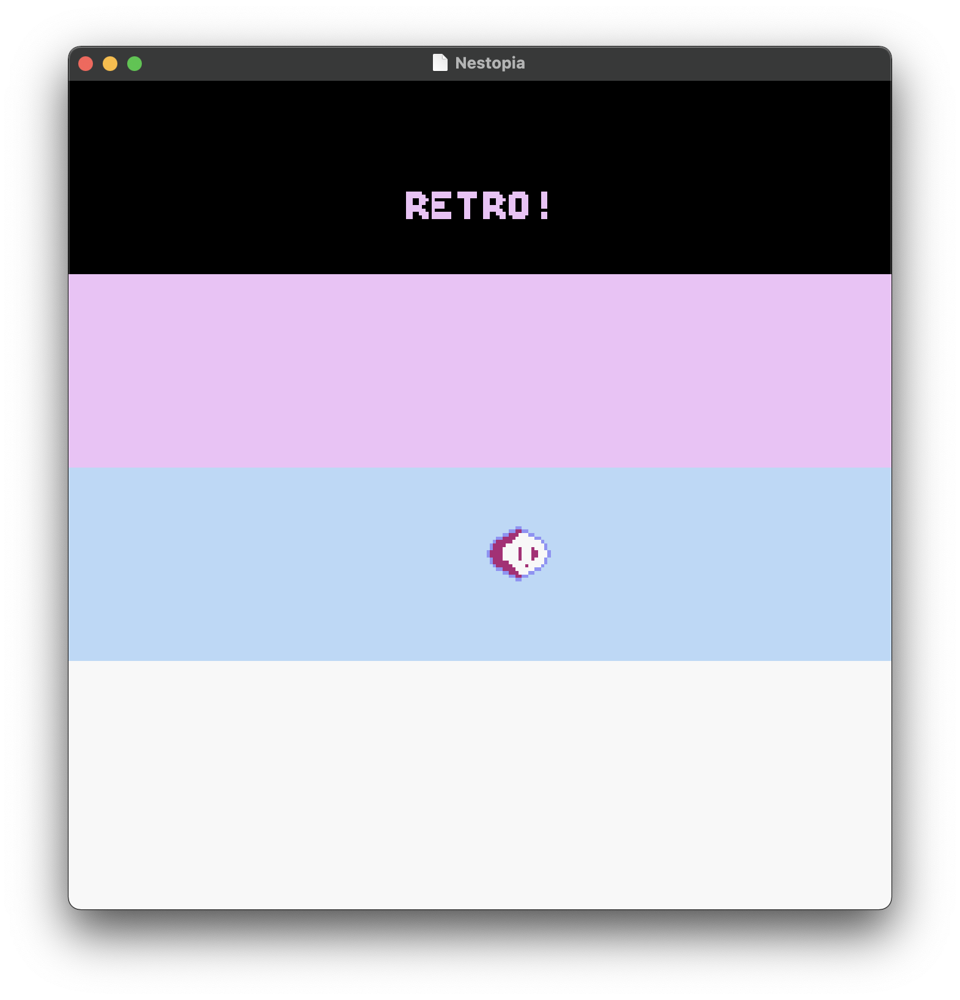
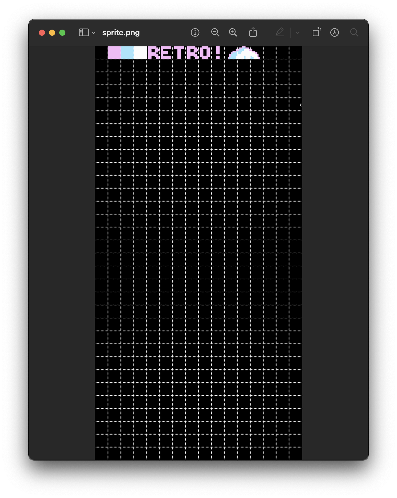
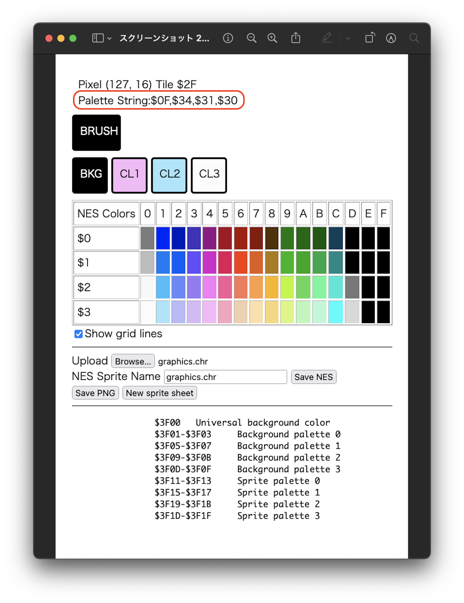

# [**Adding Sprites**](sprites.asm)

Learned something in this one that I thought would be so abstract and complicated, but was almost frustratingly simple.



<sub>**Figure 1**: The result of this project.</sub>

### Sections

1. [**The ROM's "Init" Code**](#the-roms-"init"-code)
2. [**Sprites**](#sprites)
3. [**The NMI joins the battle**](#the-nmi-joins-the-battle)
4. [**Stepping Back For A Bit: The General Structure of Our Code So Far**](#stepping-back-for-a-bit-the-general-structure-of-our-code-so-far)

### The ROM's "Init" Code

According to the [**NesDev Wiki**](https://www.nesdev.org/wiki/Init_code) there are certain processes that an NES ROM must perform upon reset, and quite a few of those were missing from Jonathan's tutorial. His tutorial series is coming to an end soon, so I started to look for alternatives and found that most others included these additional boilerplate `RESET` instructions. As such, I will talk about those here before moving on to the sprite code:


The first thing to note here is that I started defining constants for both addresses and values that I was loading and storing in various registers/places in memory. It was about time I got around to it, tbh. For the `RESET` code segment, the following constants were defined, which I hope are aptly named to be fairly self-explanatory:

```asm
APUDISABLE = #$40                     ; APU === Audio Proc. Unit
APUDISADDR = $4017
DMCCHANDIS = $4010                    ; disable APU DMC channel

STACKINIT  = #$FF

NMIENABLER = #%10000000               ; Binary 128. Enable NMI, sprites and background on table 0...
SPRENABLER = #%00011110               ; Enables sprites, enable backgrounds—binary 30
```

And here they are being used:

```asm
RESET:
	SEI                               ; disable IRQs
	CLD                               ; disable decimal mode

    ; Disable APU frame interrupt
	LDX APUDISABLE	
	STX APUDISADDR

    ; Set up stack
	LDX STACKINIT                     ; X = #$FF
	TXS       

	INX                               ; now, X = 0
	STX PPUCTRL                       ; disable NMI
	STX PPUMASK                       ; disable rendering
	STX DMCCHANDIS                    ; disable DMC IRQs

    ; Graphics and Sprites.
	JSR LoadBackground				  ; JSR operation will jump to that label, then return here once it is done
	JSR LoadPalettes				  ; Same operation, but for the palettes
	JSR LoadAttributes
    JSR LoadBubble

	LDA NMIENABLER
	STA PPUCTRL						  ; ...which will use that address $2000 (PPUCTRL) we sent the PPU earlier

	LDA SPRENABLER					  ; 
	STA PPUMASK						  ; $2001; Controls the rendering of sprites and backgrounds, as well as colour effects.

	LDA #$00						  ; Disable background scrolling
	STA PPUADDR						  ; Writes twice
	STA PPUADDR
	STA PPUSCROLL					  ; Writes twice
	STA PPUSCROLL
```

Our new set of instructions are doing the following:

1. Disable maskable interrupts (`SEI`) and clear decimal mode (`CLD`—the 6502 inside the NES is physically unable to use decimal mode, anyway).
2. Disable the APU's [**delta modulation channel's**](https://www.nesdev.org/wiki/APU_DMC) (DMC's) interrupts.
3. Set up the stack to a known state—in this case `#$FF`.

Everything after that is stull we have seen before, such as disabling some PPU flags and enabling the [**NMI**](https://www.nesdev.org/wiki/NMI) for sprite rendering (we'll get there in a bit).

Apparently, following these instructions, we must:

> Wait at least 30,000 cycles (see [**PPU power up state**](https://www.nesdev.org/wiki/PPU_power_up_state)) before reading or writing registers $2003 through $2007. This is commonly done by waiting for the PPU to signal the start of vertical blank twice through $2002.

This is actually the first mention I've seen in Famicom references of the vertical blank, which I covered in a lot more depth when I was looking at the [**Atari 2600**](https://github.com/sebastianromerocruz/atari-6502-projects/tree/main/nijigasaki#description). This is what these two loops look like:

```asm
@VBlankWait1:                          ; First wait for vblank to make sure PPU is ready
	BIT PPUSTATUS					   ; Clear the VBL flag if it was set at reset time
	BPL VBlankWait1					   ; At this point, about 27384 cycles have passed

@VBlankWait2:                          ; Second wait for vblank, PPU is ready after this
	BIT PPUSTATUS
	BPL VBlankWait2					   ; At this point, about 57165 cycles have passed
```

<sub>**Note**: Not sure why NESDev goes for `@`-signs for these two subroutines. I'll come back to it at some point if I find out.</sub>

[**Best practices**](https://www.nesdev.org/wiki/PPU_power_up_state#Best_practice) recommend doing "initialization [processes], such as getting the mapper and RAM into a known state, between the two loops." Jacob Roman's [**tutorial**](https://www.vbforums.com/showthread.php?858389-NES-6502-Programming-Tutorial-Part-1-Getting-Started) series shows us how to do this with a `ClrMem` subroutine:

```asm
@VBlankWait1:                          ; First wait for vblank to make sure PPU is ready
	BIT PPUSTATUS					   ; Clear the VBL flag if it was set at reset time
	BPL VBlankWait1					   ; At this point, about 27384 cycles have passed

@ClrMem:
    ; Load and store the value of 0 into the accumulator
	LDA #$00
	STA $0000,x
	STA $0100,x
	STA $0200,x
	STA $0400,x
	STA $0500,x
	STA $0600,x
	STA $0700,x
	LDA #$FE
	STA $0300,x

    ; ...and increase the value of x...
	INX

    ; Until there is an overflow back to 0
	BNE ClrMem
   
@VBlankWait2:                          ; Second wait for vblank, PPU is ready after this
	BIT PPUSTATUS
	BPL VBlankWait2					   ; At this point, about 57165 cycles have passed
```

He also includes a really nice memory map for the Famicom, which I will include in a [**separate markdown file**](assets/NESMEM.md) to avoid cluttering this one.

### Sprites

One of the things that got me fascinated with NES programming was this awesome [**video**](https://youtu.be/ZWQ0591PAxM?t=253) by [**Morphcat Games**](http://morphcat.de/) about the development process for their game [**Micro Mages**](http://morphcat.de/micromages/#buy), whereby they explain how they optimised their sprite sheet to be able to fit multiple bosses and level designs (Altice's [**I Am Error**](https://mitpress.mit.edu/books/i-am-error) also mentions similar techniques being used in programming _Super Mario Bros_). As is often the case, I found these things to sound so much more complicated than they actually are, as I soon discovered.

I decided to make my character a spheroidal bubble that is, crucially, horizontally symmetrical:



The reason why this is relevant becomes clear in my [**sprite `asm` file**](assets/bubble-sprite.asm):

```asm
bubbleSprite:
	.db $80, $0A, %00000000, $80
	.db $80, $0B, %00000000, $88
	.db $80, $0C, %00000000, $90
	.db $88, $0A, %10000000, $80
	.db $88, $0B, %10000000, $88
	.db $88, $0C, %10000000, $90
```

My bubble character is comprised of six tiles—thus the six 4-byte lines. In order, these four bytes represent the following:

1. Vertical screen position (top left corner)
2. Graphical tile (hex value of the tile in the sprite sheet)
3. Attributes (%76543210):
    - Bits 0 and 1 are for the colour palette
    - Bits 2, 3, and 4 are not used
    - Bit 5 is priority (0 shows the sprite in front of the background, and 1 displays it behind it)
    - Bit 6 flips the sprite horizontally (0 is normal, 1 is flipped)
    - Bit 7 flips the sprite vertically (0 is normal, 1 is flipped)
4. Horizontal screen position (top left corner)

Of particular important here are bytes 2 and 3. We use tiles `$0A`, `$0B`, and `$0C` twice; their only different is their starting vertical screen position, and their attribute byte.

The attribute byte is literally the big sprite magic that I thought to be so complex about Micro Mages and SMB: we can reuse symmetrical tiles by flipping them backwards and/or upside down (that is why byte 7 is a `1` for the latter three tiles)!

It may not sound like a super difficult concept now, but when I first read about this, I didn't even know bytes could be represented in binary, but less that they could act as switches for such crucial things like orientation and priority. One of the greatest joys of computer science is to revisit concepts that used to sound impossible to you at some point in time only to find that they weren't all that complicated to begin with.

### The NMI joins the battle

Anyhow, after loading the background, palette, and attribute data, we use `JSR` to start loading the bubble:

```asm
JSR LoadBubble
```

```asm
LoadBubble:
    LDX #$00
.BubbleLoop:
    LDA bubbleSprite,X
    STA BUBBLELOC,X
    INX
    CPX BUBBLEBYTE
    BNE .BubbleLoop
    RTS
```

Notice that, unlike the background, palette, and attribute data, we jumped straight into our loop. The difference with sprite data is that we are not putting it straight into the PPU, but rather in the RAM starting at address $0300 (24 bytes of data). So how does this data make it into the PPU? This is the job of the non-maskable interrupt, which thus far has been doing...not very much:

```asm
NMI:
    LDA #$00                          ; We load the low byte of the CPU...
    STA OAMADDR                       ; ...into the PPU
    LDA BUBBLELOC                     ; We load the high byte of the CPU
    STA OAMDMA                        ; ...into the OAM DMA high address

	RTI
```

`OAMDMA`'s address is `$4014` which, as we have seen in our memory map, corresponds to the sprite DMA (Direct Memory Access) register.

---

And that's really actually it. The last thing is just to include our bubble sprite file:

```asm
bubbleSprite:
    .include "assets/bubble-sprite.asm"
```

And we get our [**result**](#adding-spritesspritesasm).

One more thing that I did realise was that I was including the wrong palette lines in my [**file**](assets/palettes.asm):

```asm
    .db $0F,$34,$31,$30, $0F,$0F,$0F,$0F, $0F,$0F,$0F,$0F, $0F,$0F,$0F,$0F  ; Background
    .db $0F,$22,$15,$30, $0F,$0F,$0F,$0F, $0F,$0F,$0F,$0F, $0F,$0F,$0F,$0F  ; Sprites
```

I basically was just copying and pasting Jonathan's palette colour codes (second line) for both background and sprite data. I realised that the [**sprite tool**](https://eonarheim.github.io/NES-Sprite-Editor/) I am used gives me the relevant data that I need for this palette:



<sub>**Figure 2**: Information provided by our sprite tool.</sub>

So now the background is of the colour palette that I originally intended, while I left the sprite with Jonathan's palette so that it would pop out a little against the background.

### Stepping Back For A Bit: The General Structure of Our Code So Far

At this point in these projects, I started to feel a bit anxious about the size of my main `nes` file. Mostly, I felt that if I had to start over from scratch, I would not be able to do so without looking at the tutorial for reference. As a CS educator, this means one thing and one thing only to me: I understand the material, but I haven't absorbed it yet.

Absorbing things takes time and repetition, so it's a bit unfair to ask of myself to have every single line of code committed to programmers' muscle memory, so I'm going to start by getting a quick sketch of my program so far into memory before moving on:

```asm
;;;;;;;;;;;;;;;;;;;;;;;;;;;;;;;;;;;;;;;;;;;;;;;;;;;;;;;;;;;;;;;;;;;;;;;;;;;;;;;;;;;;;;;;;;;;;;;;;;;;;;;;;
;; 1. Housecleaning `.ines` directives
;;;;;;;;;;;;;;;;;;;;;;;;;;;;;;;;;;;;;;;;;;;;;;;;;;;;;;;;;;;;;;;;;;;;;;;;;;;;;;;;;;;;;;;;;;;;;;;;;;;;;;;;;

;;;;;;;;;;;;;;;;;;;;;;;;;;;;;;;;;;;;;;;;;;;;;;;;;;;;;;;;;;;;;;;;;;;;;;;;;;;;;;;;;;;;;;;;;;;;;;;;;;;;;;;;;
;; 2. Helper and macros files
;;;;;;;;;;;;;;;;;;;;;;;;;;;;;;;;;;;;;;;;;;;;;;;;;;;;;;;;;;;;;;;;;;;;;;;;;;;;;;;;;;;;;;;;;;;;;;;;;;;;;;;;;

;;;;;;;;;;;;;;;;;;;;;;;;;;;;;;;;;;;;;;;;;;;;;;;;;;;;;;;;;;;;;;;;;;;;;;;;;;;;;;;;;;;;;;;;;;;;;;;;;;;;;;;;;
;; 3. Variables
;;;;;;;;;;;;;;;;;;;;;;;;;;;;;;;;;;;;;;;;;;;;;;;;;;;;;;;;;;;;;;;;;;;;;;;;;;;;;;;;;;;;;;;;;;;;;;;;;;;;;;;;;

;;;;;;;;;;;;;;;;;;;;;;;;;;;;;;;;;;;;;;;;;;;;;;;;;;;;;;;;;;;;;;;;;;;;;;;;;;;;;;;;;;;;;;;;;;;;;;;;;;;;;;;;;
;; 4. Constants
;;;;;;;;;;;;;;;;;;;;;;;;;;;;;;;;;;;;;;;;;;;;;;;;;;;;;;;;;;;;;;;;;;;;;;;;;;;;;;;;;;;;;;;;;;;;;;;;;;;;;;;;;

;;;;;;;;;;;;;;;;;;;;;;;;;;;;;;;;;;;;;;;;;;;;;;;;;;;;;;;;;;;;;;;;;;;;;;;;;;;;;;;;;;;;;;;;;;;;;;;;;;;;;;;;;
;; 5. Reset
;;;;;;;;;;;;;;;;;;;;;;;;;;;;;;;;;;;;;;;;;;;;;;;;;;;;;;;;;;;;;;;;;;;;;;;;;;;;;;;;;;;;;;;;;;;;;;;;;;;;;;;;;

;;;;;;;;;;;;;;;;;;;;;;;;;;;;;;;;;;;;;;;;;;;;;;;;;;;;;;;;;;;;;;;;;;;;;;;;;;;;;;;;;;;;;;;;;;;;;;;;;;;;;;;;;
;; 6. Vertical blanks and memory clear
;;;;;;;;;;;;;;;;;;;;;;;;;;;;;;;;;;;;;;;;;;;;;;;;;;;;;;;;;;;;;;;;;;;;;;;;;;;;;;;;;;;;;;;;;;;;;;;;;;;;;;;;;

;;;;;;;;;;;;;;;;;;;;;;;;;;;;;;;;;;;;;;;;;;;;;;;;;;;;;;;;;;;;;;;;;;;;;;;;;;;;;;;;;;;;;;;;;;;;;;;;;;;;;;;;;
;; 7. Subroutines (load background, palettes, etc.)
;;;;;;;;;;;;;;;;;;;;;;;;;;;;;;;;;;;;;;;;;;;;;;;;;;;;;;;;;;;;;;;;;;;;;;;;;;;;;;;;;;;;;;;;;;;;;;;;;;;;;;;;;

;;;;;;;;;;;;;;;;;;;;;;;;;;;;;;;;;;;;;;;;;;;;;;;;;;;;;;;;;;;;;;;;;;;;;;;;;;;;;;;;;;;;;;;;;;;;;;;;;;;;;;;;;
;; 8. NMI
;;;;;;;;;;;;;;;;;;;;;;;;;;;;;;;;;;;;;;;;;;;;;;;;;;;;;;;;;;;;;;;;;;;;;;;;;;;;;;;;;;;;;;;;;;;;;;;;;;;;;;;;;

;;;;;;;;;;;;;;;;;;;;;;;;;;;;;;;;;;;;;;;;;;;;;;;;;;;;;;;;;;;;;;;;;;;;;;;;;;;;;;;;;;;;;;;;;;;;;;;;;;;;;;;;;
;; 9. Sprite bank files
;;;;;;;;;;;;;;;;;;;;;;;;;;;;;;;;;;;;;;;;;;;;;;;;;;;;;;;;;;;;;;;;;;;;;;;;;;;;;;;;;;;;;;;;;;;;;;;;;;;;;;;;;

;;;;;;;;;;;;;;;;;;;;;;;;;;;;;;;;;;;;;;;;;;;;;;;;;;;;;;;;;;;;;;;;;;;;;;;;;;;;;;;;;;;;;;;;;;;;;;;;;;;;;;;;;
;; 10. Sprite bank files
;;;;;;;;;;;;;;;;;;;;;;;;;;;;;;;;;;;;;;;;;;;;;;;;;;;;;;;;;;;;;;;;;;;;;;;;;;;;;;;;;;;;;;;;;;;;;;;;;;;;;;;;;

;;;;;;;;;;;;;;;;;;;;;;;;;;;;;;;;;;;;;;;;;;;;;;;;;;;;;;;;;;;;;;;;;;;;;;;;;;;;;;;;;;;;;;;;;;;;;;;;;;;;;;;;;
;; 11. Sprite bank data (chr file)
;;;;;;;;;;;;;;;;;;;;;;;;;;;;;;;;;;;;;;;;;;;;;;;;;;;;;;;;;;;;;;;;;;;;;;;;;;;;;;;;;;;;;;;;;;;;;;;;;;;;;;;;;
```