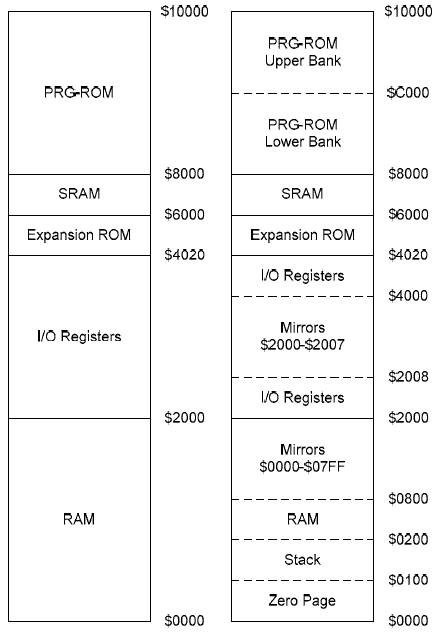

# Famicom CPU Memory Map

**Figure 1**: Famicom Memory Map.

- **`$FFFA` - `$FFFF`** is where all of your interrupts are located such as `NMI`, `RESET`, and `IRQ`
- **`$8000` - `$FFF9`** is the PRG-ROM, which basically means it's where all of your programming data will be located in, 32K of it. Larger programs can perform bank switching to execute other code.
- **`$6000`** - **`$7FFF`** even though it says SRAM, I personally call it WRAM because it's Work Ram.
- **`$4018` - `$5FFF`** is the expansion ROM, which is for the expansion located on the bottom of the NES. These addresses are never used due to the fact that no expansion device was ever made for it.
- **`$4017`**: Controller 2 plus `IRQ` interrupts
- **`$4016`**: Controller 1
- **`$4015`**: APU Sound/Vertical Clock Signal Register
- **`$4014`**: Sprite DMA Register (Direct Memory Access)
- **`$4013`**: APU Delta Modulation Data Length Register
- **`$4012`**: APU Delta Modulation Address Register
- **`$4011`**; APU Delta Modulation D/A Register
- **`$4010`**: APU Delta Modulation Control Register
- **`$400F`**: APU Noise Frequency Register 2
- **`$400E`**: APU Noise Frequency Register 1
- **`$400D`**: Not Used
- **`$400C`**: APU Noise Control Register 1
- **`$400B`**: APU Triangle Frequency Register 2
- **`$400A`**: APU Triangle Frequency Register 1
- **`$4009`**: APU Triangle Control Register 2
- **`$4008`**: APU Triangle Control Register 1
- **`$4007`**: APU Pulse 2 Coarse Tune Register
- **`$4006`**: APU Pulse 2 Fine Tune Register
- **`$4005`**: APU Pulse 2 Ramp Control Register
- **`$4004`**: APU Pulse 2 Control Register
- **`$4003`**: APU Pulse 1 Coarse Tune (CT) Register
- **`$4002`**: APU Pulse 1 Fine Tune (FT) Register
- **`$4001`**: APU `Pulse 1 Ramp Control Register
- **`$4000`**: APU Pulse 1 Control Register
- **`$2008`** - **`$3FFF`**: are mirrors of `$2000` - `$2007` over and over again. Any data changed between `$2000` - `$2007` will be copied in `$2008` - `$3FFF` and vice versa, hence the term _"mirroring"_.
- **`$2007`**: VRAM I/O Register
- **`$2006`**: VRAM Address Register 2
- **`$2005`**: VRAM Address Register 1
- **`$2004`**: SPR-RAM I/O Register
- **`$2003`**: SPR-RAM Address Register
- **`$2002`**: PPU Status Register
- **`$2001`**: PPU Control Register 2
- **`$2000`**: PPU Control Register 1
- **`$0800`** - **`$1FFF`** are mirrors of $0000-$07FF over and over again.
- **`$0300`** - **`$07FF`** is RAM
- **`$0200`** - **`$02FF`** is where your sprite data from your CHR file is stored. Note that more sprite data can be swapped using bank switching so you are not limited.
- **`$0100`** - **`$01FF`** is the stack, and generally used for arrays I believe.
- **`$0000`** - **`$00FF`** is known as the Zero Page. Generally, variables can be declared here.